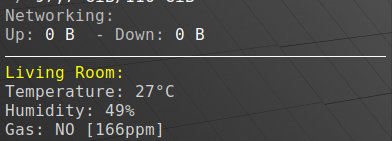

# home-monitor-sever
# Installation 
```pip install -r requirements.txt```

# Config
Rename .env.local to .env and fill credentials
```
# Api client token
API_BEARER_TOKEN=

# Telegram 
TELEGRAM_API_TOKEN=
TELEGRAM_CHAT_ID=

# Database
DATABASE=
```

# Run 
```uvicorn main:app --reload```

# Realtime data in Conky
For simple monitoring on desktop by conky, create file with code blow 
```python
import requests

API_URL = "<Your API URL>"
BEARER_TOKEN = "<API TOKEN>"
headers = {
    "Authorization": f"Bearer {BEARER_TOKEN}"
}

def read():
    try:
        response = requests.get(API_URL, headers=headers)
        data = response.json()
        if 'data' in data and len(data['data']) > 0:
            entry = data['data'][0]
            temp = entry['temperature']
            humidity = entry['humidity']
            gas = entry['gasLevel']
            is_gas_detected = 'YES' if entry['isGasDetected'] else 'NO'
            return f"Temperature: {temp:,.0f}°C\nHumidity: {humidity:,.0f}%\nGas: {is_gas_detected} [{gas}ppm]"
    except Exception as e:
        return "Error when read data"

print(read())
```
Open and edit conky config
`/etc/conky/conky.conf`,
add following code at the end and replace `<path>` with path to your file:
```
$hr
${color yellow}Living Room:
${color lightgrey}${execi 10 python3 <path>}
```

